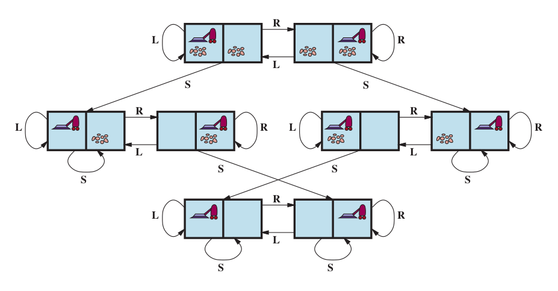

<div align="center" style="display: inline_block">
  
  
  
</div>

# 🗂️​ Estrutura do Repositório

- `src/`: Diretório com os scripts C++ usados para gerar os grafos e realizar as análises.
- `imgs/`: Diretório com as imagens utilizadas na documentação.
- Arquivos `.cpp` e `.hpp`: O código é organizado em arquivos de cabeçalho e implementação para facilitar a manutenção e compreensão.

# ⚠️ Apresentação do Problema 

<p align="center">
 
</p>
<p align="center">
<em>Figura 1: Representação do agente aspirador de pó e seus possíveis estados. </em>
</p>

<div align="justify">

A figura representa o agente aspirador de pó, entenda seu funcionamento. Basicamente o agente aspirador de pó segue as suposições listadas abaixo:

1. A medida de desempenho ofereça o prêmio de um ponto para cada quadrado limpo.

2. A “geografia” do ambiente seja conhecida a priori, mas a distribuição da sujeira e a posição inicial do agente é desconhecida. 

3. Quadrados limpos permanecem limpos, e a aspiração limpa o quadrado atual. 

4. O agente percebe corretamente sua posição e se essa posição contém sujeira.

5. As únicas ações disponíveis são Left, Right, Suck e NoOp (não fazer nada).

6. A função do agente é limpar se o quadrado tem sujeira e ir para o outro quadrado, caso contrário.

</div>

<p align="center">
 
</p>
<p align="center">
<em>Figura 2: Pseudocódigo do agente reativo simples no ambiente descrito na Figura 1. </em>
</p>

<div align="justify">

Dado o que foi discutido, e com base no pseudocódigo acima implemente um agente reativo simples para o ambiente do aspirador. Execute o ambiente com este agente para todas as configurações iniciais de sujeira possı́veis e locais dos agentes. Registre a pontuação de desempenho para cada configuração e a pontuação média geral.

</div>

# 💡 Solução do Problema 

<div align="justify">

O projeto foi desenvolvido para resolver o problema de manter um ambiente consistindo de duas áreas, A e B, limpo de forma simples.

A função `reflexVacuumAgent` é a principal, responsável pelo comportamento do agente. Esta função toma como parâmetros a localização atual do agente (`Location`) e o estado dessa localização (`Status`), que pode ser `Dirty` (sujo) ou `Clean` (limpo). Dependendo do estado atual, o agente escolhe a próxima ação:

- Se o agente detecta que a localização atual está suja (`Dirty`), ele executa a ação `Suck`, que limpa a localização.
- Se a localização atual está limpa (`Clean`) e o agente está na localização A, ele se move para a direita, indo para a localização B (`Right`).
- Se a localização atual está limpa e o agente está na localização B, ele se move para a esquerda, voltando para a localização A (`Left`).

</div>

```C
Action ReflexVacuumAgent::reflexVacuumAgent(Location location, Status status) {
    if (status == Status::Dirty) {
        return Action::Suck;
    } else if (location == Location::A) {
        return Action::Right;
    } else if (location == Location::B) {
        return Action::Left;
    }
    return Action::NoOp;
}
```
<div align="justify">

No arquivo `main.cpp` o programa então itera sobre todas as possíveis combinações iniciais de estados para as localizações A e B, que podem estar limpas ou sujas. 

</div>

```C
// Loop sobre os dois locais possiveis onde o aspirador pode começar: A ou B
    for (Location startingLocation : allLocations) {
        // Loop sobre os dois estados possiveis de A: limpo ou sujo
        for (Status statusA : allStatuses) {
            // Loop sobre os dois estados possiveis de B: limpo ou sujo
            int scenarioScore = 0; // Pontuação para o cenário atual
            // ...
        }
    }
}
```
<div align="justify">

A frente, inicia-se outro loop, onde o agente verifica o estado do local atual e decide a próxima ação baseada na regra definida na função `reflexVacuumAgent`. Se o agente aspira em um local sujo, a pontuação é incrementada. Caso contrário, o agente se move para a outra localização.

</div>

```C
// Loop continua até que ambos os locais A e B estejam limpos
while (statusAtA == Status::Dirty || statusAtB == Status::Dirty) {
    // Determina a próxima ação com base na localização e no status atual
    Action action = agent.reflexVacuumAgent(location, currentStatus);
    // ...
}

```

<div align="justify">

No final de todos os cenários, o programa calcula e exibe a pontuação média geral. Isso fornece uma medida do desempenho do agente em diferentes configurações do ambiente.

</div>

# 🔄 Compilação e Execução 

<div align="justify">

Por fim, esse programa possui um arquivo (`Makefile`) e um (`CMakeLists`), os quais realizam todo o procedimento de compilação e execução. Para tanto, cabe ao usuário escolher o de sua preferência, porém se atente ao fato de que para cada um temos as seguintes diretrizes de execução:

</div>

## Makefile

<table align="center">
  <tr>
    <th>Comando</th>
    <th>Função</th>
  </tr>
  <tr>
    <td>make clean</td>
    <td>Apaga a última compilação realizada contida na pasta build</td>
  </tr>
  <tr>
    <td>make</td>
    <td>Executa a compilação do programa utilizando o gcc, e o resultado vai para a pasta build</td>
  </tr>
  <tr>
    <td>make run</td>
    <td>Executa o programa da pasta build após a realização da compilação</td>
  </tr>
</table>
	
## CMake

<table align="center">
  <tr>
    <th>Comando</th>
    <th>Função</th>
  </tr>
  <tr>
    <td>cmake -B ./build</td>
    <td>Cria as instâncias da pasta build necessárias para execução do programa</td>
  </tr>
  <tr>
    <td>cmake --build ./build</td>
    <td>Executa a compilação do programa utilizando o cmake, e o resultado vai para a pasta build</td>
  </tr>
  <tr>
    <td>./build/app</td>
    <td>Executa o programa da pasta build após a realização da compilação</td>
  </tr>
</table>

# 📞 Contato

<table align="center">
  <tr>
    <th>Participante</th>
    <th>Contato</th>
  </tr>
  <tr>
    <td>Celso</td>
    <td><a href="https://t.me/celso_vsf"> </td>
  </tr>
</table>
